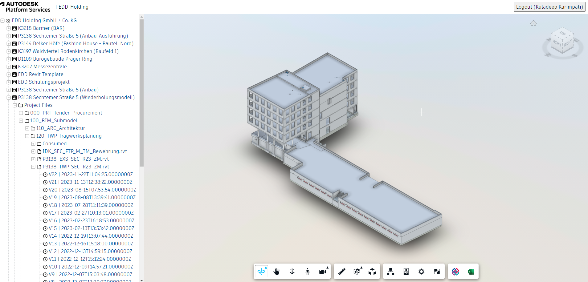

# Extensions on Hubs Browser (Node.js)

## Prologue

This web application comprises three extensions developed using the Autodesk Forge API. They are explained below, with a demonstration video provided for each. These extensions were developed based on the available boilerplate for the viewer and hubs at [Offical Documentation](https://get-started.aps.autodesk.com/tutorials/simple-viewer/). Refer to the [official GitHub repository](https://github.com/autodesk-platform-services) and the official documentation for a complete overview of the boilerplate code and the structure of the extensions.

---

- **IFC Converter:** This extension facilitates the conversion of any rvt file to the ifc format and allows for easy downloading.
  - Watch the IFC Converter in action: 

    <video width="450" height="290" controls>
      <source src="_assets/IFC_Converter.mp4" type="video/mp4">
      Your browser does not support the video tag.
    </video>

- **Excel Extractor:** This extension is designed to extract model parameter data and save it into an Excel file.
  - Watch the Excel Extractor in action:

    <video width="450" height="290" controls>
      <source src="_assets/Excel-extractor.mp4" type="video/mp4">
      Your browser does not support the video tag.
    </video>
  
- **Phase Filters:** This extension was developed to support the filtering of Revit elements based on phases.
  - Watch the Phase FIlter in action:

    <video width="450" height="290" controls>
      <source src="_assets/Phase FIlters.mp4" type="video/mp4">
      Your browser does not support the video tag.
    </video>

## Local Development

### Prerequisites

- [APS credentials](https://forge.autodesk.com/en/docs/oauth/v2/tutorials/create-app)
- Provisioned access to [BIM 360 Docs](https://forge.autodesk.com/en/docs/bim360/v1/tutorials/getting-started/manage-access-to-docs/)
or Autodesk Construction Cloud
- [Node.js](https://nodejs.org) (we recommend the Long Term Support version)
- Terminal (for example, [Windows Command Prompt](https://en.wikipedia.org/wiki/Cmd.exe)
or [macOS Terminal](https://support.apple.com/guide/terminal/welcome/mac))

### Setup & Run

- Clone this repository
- Install dependencies: `yarn install` or `npm install`
- Setup environment variables:
  - `APS_CLIENT_ID` - your APS application client ID
  - `APS_CLIENT_SECRET` - your APS application client secret
  - `APS_CALLBACK_URL` - URL for your users to be redirected to after they successfully log in with their Autodesk account
    - For local development, the callback URL is `http://localhost:8080/api/auth/callback`
    - For applications deployed to a custom domain, the callback URL is `http://<your-domain>/api/auth/callback` or `https://<your-domain>/api/auth/callback`
    - Do not forget to update the callback URL for your application in https://forge.autodesk.com/myapps as well
  - `SERVER_SESSION_SECRET` - arbitrary phrase used to encrypt/decrypt server session cookies
  - `IFC_ALLOWED_USERS` - Autodesk usernames of authorized users for the IFC Converter extension, eg. ['Kuladeep Karimpati', 'Mohannad Mira']. If none are specified, access to the extension will be restricted
  
- Run the server: `yarn start` or `npm start`

> When using [Visual Studio Code](https://code.visualstudio.com),
you can specify the env. variables listed above in a _.env_ file in this
folder, and run & debug the application directly from the editor.

## Troubleshooting

Please contact us via https://forge.autodesk.com/en/support/get-help.

## License

This sample is licensed under the terms of the [MIT License](http://opensource.org/licenses/MIT).
Please see the [LICENSE](LICENSE) file for more details.

---

## Phase Filter Extension Documentation

The **Phase Filter Extension** i.e [`wwwroot\extensions\PhaseFIlterExtension.js`](wwwroot\extensions\PhaseFIlterExtension.js) is a custom extension for Autodesk's Forge Viewer that allows users to filter Revit elements based on their construction phases. This extension provides an interactive UI for toggling visibility of elements belonging to specific phases, such as "Bestand," "Abbruch," "Neubau," and others.

### Key Features

- **Phase Filtering**: Isolate or hide elements in the model based on their construction phases.
- **Interactive UI**: A toolbar button and panel with checkboxes for toggling visibility of elements by phase.
- **Dynamic Data Handling**: Automatically identifies and categorizes elements into phases based on their properties.

### Code Overview

#### Class: `PhaseFilterExtension`

This class extends the `BaseExtension` class and implements the logic for filtering elements by phases. Below is a breakdown of its key components:

#### 1. Initialization
- The constructor initializes the extension with a viewer instance and options.
- The `load()` method logs the extension's loading status and returns `true` to indicate successful loading.
- The `unload()` method cleans up resources, such as toolbar buttons and panels, when the extension is unloaded.

#### 2. Phase Filtering Logic

##### `initializeDbIds()`
This asynchronous function categorizes model elements into different phases by:
- Fetching all leaf nodes in the model.
- Filtering elements based on their "Phase Created" and "Phase Demolished" properties.
- Storing categorized elements in arrays (`bestandDbids`, `abbruchDbids`, `neubauDbids`, etc.).

##### `findPropertyValuesForCondition(selection, propFilter, propValues)`
This helper function retrieves elements that match specific property conditions. It:
- Filters elements based on the provided property values.
- Returns the `dbIds` of elements that satisfy the conditions.

#### 3. UI Interaction

##### `onToolbarCreated()`
- Creates a toolbar button and a panel for the extension.
- Adds a tab to the panel with checkboxes for each phase.
- Toggles the visibility of the panel when the button is clicked.

##### `handleCheckboxChange(phase, checkbox)`
- Updates the list of filtered elements based on the checkbox state.
- Isolates the filtered elements in the viewer.

##### `getPhaseDbids(phase)`
- Returns the `dbIds` of elements belonging to a specific phase.

#### 4. Event Handling

##### `onModelLoaded(model)`
- Triggered when a model is loaded into the viewer.
- Calls `initializeDbIds()` to categorize elements into phases.

### Usage Flow

1. **Loading the Extension**:
   - The extension is registered with the Forge Viewer using `Autodesk.Viewing.theExtensionManager.registerExtension`.

2. **Toolbar and Panel**:
   - A toolbar button is added to the viewer.
   - Clicking the button toggles the visibility of the panel.

3. **Phase Filtering**:
   - The panel displays checkboxes for each phase.
   - Users can toggle checkboxes to isolate or hide elements belonging to specific phases.

4. **Dynamic Updates**:
   - The extension dynamically updates the filtered elements based on user interaction.

### Important Notes

- **Property-Based Filtering**: The extension relies on the "Phase Created" and "Phase Demolished" properties to categorize elements. Ensure these properties are present in the model.
- **Error Handling**: The extension includes error handling for property retrieval and UI interactions.

### Conclusion

The **Phase Filter Extension** enhances the Forge Viewer by providing an intuitive way to filter elements based on construction phases. It is a powerful tool for users working with Revit models, enabling better visualization and analysis of phased construction data.

---

## IFC Converter Extension Documentation

The **IFC Converter Extension** i.e [`wwwroot\extensions\ToIfcExtension.js`](wwwroot\extensions\ToIfcExtension.js) is a custom extension for Autodesk's Forge Viewer that enables users to convert Revit models (`.rvt`) into the Industry Foundation Classes (IFC) format. This extension ensures that only authorized users can perform the conversion, providing a secure and efficient workflow for exporting models.

### Key Features

- **Model Conversion**: Converts Revit models to the IFC format for interoperability.
- **User Authorization**: Restricts access to the conversion feature to a predefined list of authorized users.
- **Toolbar Integration**: Adds a toolbar button to trigger the conversion process.

### Code Overview

#### Class: `ifcConverterExtension`

This class extends the `BaseExtension` class and implements the logic for converting Revit models to IFC format. Below is a breakdown of its key components:

#### 1. Initialization
- The constructor initializes the extension with a viewer instance and options.
- The `load()` method fetches the list of authorized users and logs the extension's loading status.
- The `unload()` method cleans up resources, such as toolbar buttons, when the extension is unloaded.

#### 2. User Authorization

##### `fetchIfcAlloweUsers()`
This asynchronous function fetches the list of authorized users from the server:
- Sends a request to the `/api/ifc/allowed_users` endpoint.
- Retrieves and returns the `IFC_ALLOWED_USERS` list.
- Handles errors gracefully by logging them and returning an empty list.

#### 3. Toolbar Integration

##### `onToolbarCreated()`
- Creates a toolbar button labeled "Convert the rvt model to Ifc."
- Clicking the button triggers the `translateToIfc()` method to start the conversion process.

#### 4. Model Conversion

##### `translateToIfc()`
This method handles the conversion process:
- Retrieves the current user's username from the `data` object.
- Checks if the user is authorized by comparing the username against the `IFC_ALLOWED_USERS` list.
- If authorized, calls the `toIfc()` function to perform the conversion.
- If unauthorized, displays an alert message to inform the user.

### Usage Flow

1. **Loading the Extension**:
   - The extension is registered with the Forge Viewer using `Autodesk.Viewing.theExtensionManager.registerExtension`.

2. **Toolbar Button**:
   - A toolbar button is added to the viewer.
   - Clicking the button initiates the IFC conversion process.

3. **Authorization Check**:
   - The extension verifies if the current user is authorized to perform the conversion.

4. **Model Conversion**:
   - If authorized, the model is converted to IFC format using the `toIfc()` function.
   - If unauthorized, the user is notified via an alert.

### Important Notes

- **Authorization**: Ensure the `/api/ifc/allowed_users` endpoint is properly configured to return the list of authorized users.
- **Error Handling**: The extension includes error handling for user authorization and server communication.
- **Dependencies**: The `toIfc()` function is responsible for the actual conversion logic and must be implemented correctly.

### Conclusion

The **IFC Converter Extension** enhances the Forge Viewer by providing a secure and user-friendly way to export Revit models to the IFC format. By restricting access to authorized users, it ensures that the conversion process is controlled and compliant with organizational policies.

---

## Excel Extractor Extension Documentation

The **Excel Extractor Extension** i.e [`wwwroot/extensions/XLSExtension.js`](wwwroot/extensions/XLSExtension.js) was originally developed by the Autodesk open-source community. With minor modifications, the extension has been integrated into our system to better suit our specific requirements.

For more details about the extension and access to the source code, please visit the [Official GitHub repository](https://github.com/autodesk-platform-services/aps-hubs-xls).